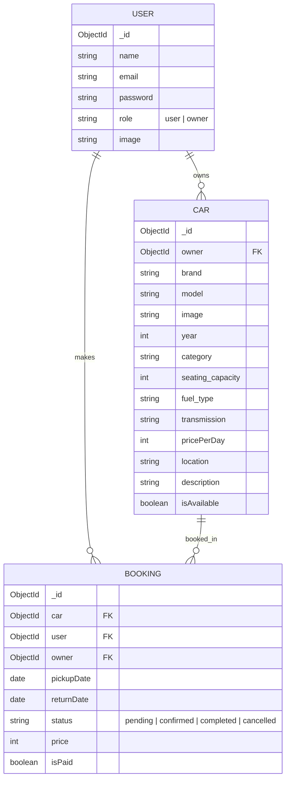

<div align="center">

# 🚗 GoNomad

### Your Journey, Your Ride.

A full-stack car rental platform connecting vehicle owners with travelers across North India.

[](https://nodejs.org/)
[](https://react.dev/)
[](https://www.mongodb.com/)
[](https://expressjs.com/)
[](https://tailwindcss.com/)

</div>

---

## 📖 About

GoNomad is a modern, production-ready car rental platform built on the **MERN stack**. It provides a dual-interface experience — **customers** can browse, book, and manage vehicle rentals, while **vehicle owners** get a dedicated dashboard to list their fleet, manage bookings, and track revenue.

The platform covers **10+ cities** across North India including Shimla, Manali, Chandigarh, Dharamshala, Dehradun, and more.

---

## ✨ Key Features

<table>
<tr>
<td width="50%">

### � For Customers
- Browse & search cars by city
- View detailed car specs (fuel, transmission, seats)
- Real-time availability checking
- Book vehicles with date selection
- Track booking status (pending → confirmed → completed)
- Responsive mobile-friendly UI

</td>
<td width="50%">

### 🏢 For Owners
- Dedicated owner dashboard with revenue stats
- Add cars with drag-and-drop image upload
- **AI-powered description generator** using Gemini
- Manage fleet — toggle availability, delete listings
- Accept or decline incoming bookings
- Upload/update profile image
- Quick navigation back to the main site

</td>
</tr>
</table>

### 🔐 Platform-wide
- JWT-based authentication (login/register)
- Role-based access control (user ↔ owner)
- **Google Gemini API** integration for generative text
- Cloud image storage via **ImageKit**
- Form validation with inline error feedback
- Smooth animations with **Framer Motion**
- Toast notifications for all actions
- Vercel-ready deployment configuration

---

## 🛠️ Tech Stack

| Layer | Technology | Version |
|-------|-----------|---------|
| **Frontend** | React | 19.x |
| **Build Tool** | Vite | Latest |
| **Styling** | Tailwind CSS | 4.x |
| **Animations** | Motion (Framer) | 12.x |
| **HTTP Client** | Axios | Latest |
| **Routing** | React Router DOM | 7.x |
| **Backend** | Express.js | 5.x |
| **Database** | MongoDB + Mongoose | 8.x |
| **Auth** | JWT + Bcrypt | — |
| **Generative AI**| Google Gemini | — |
| **File Upload** | Multer → ImageKit | — |
| **Notifications** | React Hot Toast | 2.x |

---

## 📂 Project Structure

```
GoNomad/
├── client/                          # React frontend (Vite)
│   └── src/
│       ├── assets/                  # Images, icons, static data
│       │   └── assets.js            # Centralized asset exports & dummy data
│       ├── components/              # Reusable UI components
│       │   ├── Navbar.jsx           # Main navigation bar
│       │   ├── Hero.jsx             # Landing hero with city search
│       │   ├── CarCard.jsx          # Vehicle listing card
│       │   ├── FeaturedSection.jsx  # Stats & highlights
│       │   ├── Testimonial.jsx      # Customer reviews
│       │   ├── Newsletter.jsx       # Email subscription
│       │   ├── Banner.jsx           # CTA banner
│       │   ├── Footer.jsx           # Site footer
│       │   ├── Login.jsx            # Auth modal (login/register)
│       │   ├── Loader.jsx           # Loading spinner
│       │   ├── Title.jsx            # Section title component
│       │   └── owner/              # Owner-specific components
│       │       ├── Sidebar.jsx      # Dashboard sidebar navigation
│       │       └── Title.jsx        # Owner section title
│       ├── context/
│       │   └── AppContext.jsx       # Global state & API config
│       ├── pages/
│       │   ├── Home.jsx             # Landing page
│       │   ├── Cars.jsx             # Vehicle browse & filter
│       │   ├── CarDetails.jsx       # Single car detail + booking
│       │   ├── MyBookings.jsx       # User booking history
│       │   └── owner/              # Owner dashboard pages
│       │       ├── Layout.jsx       # Dashboard layout wrapper
│       │       ├── Dashboard.jsx    # Stats & recent bookings
│       │       ├── AddCar.jsx       # Add new vehicle form
│       │       ├── ManageCars.jsx   # Fleet management
│       │       └── ManageBookings.jsx  # Booking management
│       ├── App.jsx                  # Root app with routing
│       ├── main.jsx                 # Entry point
│       └── index.css                # Global styles
│
└── server/                          # Express backend
    ├── configs/                     # DB & ImageKit configuration
    ├── controllers/
    │   ├── userController.js        # Auth, profile, car listing
    │   ├── ownerController.js       # Fleet CRUD, dashboard data
    │   ├── bookingController.js     # Booking lifecycle
    │   └── aiController.js          # Google Gemini AI integration
    ├── middleware/
    │   ├── auth.js                  # JWT verification middleware
    │   └── multer.js                # File upload config
    ├── models/
    │   ├── User.js                  # User schema (name, email, role, image)
    │   ├── Car.js                   # Car schema (brand, model, specs, price)
    │   └── Booking.js               # Booking schema (dates, status, price)
    ├── routes/
    │   ├── userRoutes.js            # /api/user/*
    │   ├── ownerRoutes.js           # /api/owner/*
    │   └── bookingRoutes.js         # /api/bookings/*
    ├── server.js                    # Express app entry point
    ├── vercel.json                  # Vercel deployment config
    └── package.json
```

---

## 🚀 Getting Started

### Prerequisites

- **Node.js** v16+ and npm
- **MongoDB** (local instance or [MongoDB Atlas](https://www.mongodb.com/atlas))
- **ImageKit** account ([sign up free](https://imagekit.io/))

### 1. Clone the Repository

```bash
git clone https://github.com/ctrlcoded/GoNomad.git
cd GoNomad
```

### 2. Backend Setup

```bash
cd server
npm install
```

Create a `.env` file in the `server/` directory:

```env
PORT=5000
MONGODB_URI=mongodb+srv://<username>:<password>@cluster.mongodb.net/gonomad
JWT_SECRET=your_super_secret_jwt_key
GEMINI_API_KEY=your_google_gemini_api_key
IMAGEKIT_PUBLIC_KEY=your_imagekit_public_key
IMAGEKIT_PRIVATE_KEY=your_imagekit_private_key
IMAGEKIT_URL_ENDPOINT=https://ik.imagekit.io/your_id
CLIENT_URL=http://localhost:5173
```

Start the server:

```bash
npm run server    # Development (with hot-reload via Nodemon)
npm start         # Production
```

> Server runs at `http://localhost:5000`

### 3. Frontend Setup

```bash
cd client
npm install
npm run dev
```

> Client runs at `http://localhost:5173`

### 4. Build for Production

```bash
cd client
npm run build      # Outputs to client/dist/
```

---

## � API Reference

### Authentication

| Method | Endpoint | Description | Auth |
|--------|----------|-------------|------|
| `POST` | `/api/user/register` | Create new account | ✗ |
| `POST` | `/api/user/login` | Login & get JWT token | ✗ |
| `GET` | `/api/user/data` | Get current user profile | ✓ |

### Cars

| Method | Endpoint | Description | Auth |
|--------|----------|-------------|------|
| `GET` | `/api/user/cars` | List all available cars | ✗ |
| `POST` | `/api/owner/add-car` | Add a new car listing | ✓ Owner |
| `GET` | `/api/owner/cars` | Get owner's car listings | ✓ Owner |
| `POST` | `/api/owner/toggle-car` | Toggle car availability | ✓ Owner |
| `POST` | `/api/owner/delete-car` | Delete a car listing | ✓ Owner |

### Bookings

| Method | Endpoint | Description | Auth |
|--------|----------|-------------|------|
| `POST` | `/api/bookings/check-availability` | Check car availability for dates | ✗ |
| `POST` | `/api/bookings/create` | Create a new booking | ✓ |
| `GET` | `/api/bookings/user` | Get user's bookings | ✓ |
| `GET` | `/api/bookings/owner` | Get owner's bookings | ✓ Owner |
| `POST` | `/api/bookings/change-status` | Update booking status | ✓ Owner |

### Owner

| Method | Endpoint | Description | Auth |
|--------|----------|-------------|------|
| `POST` | `/api/owner/change-role` | Upgrade user to owner role | ✓ |
| `GET` | `/api/owner/dashboard` | Get dashboard stats & data | ✓ Owner |
| `POST` | `/api/owner/update-image` | Update owner profile image | ✓ Owner |
| `POST` | `/api/owner/generate-description` | AI-generate car description | ✓ Owner |

---

## �️ Database Schema



---

## 🌐 Deployment

The project includes a `vercel.json` for serverless deployment:

**Backend** → Deploy `server/` to [Vercel](https://vercel.com/) or [Render](https://render.com/)  
**Frontend** → Deploy `client/` to [Vercel](https://vercel.com/) or [Netlify](https://netlify.com/)

> Remember to set all environment variables in your hosting dashboard.

---

## 🤝 Contributing

1. **Fork** the repository
2. Create a feature branch: `git checkout -b feature/awesome-feature`
3. Commit changes: `git commit -m "feat: add awesome feature"`
4. Push to branch: `git push origin feature/awesome-feature`
5. Open a **Pull Request**

#### Bug Reports
Open an issue with steps to reproduce, expected vs. actual behavior, and screenshots if applicable.

#### Feature Requests
Open an issue with the `enhancement` label — describe the feature, its use case, and provide mockups if possible.

---

## 📄 License

This project is licensed under the ISC License.

---

<div align="center">

**Made with ❤️ by [Aryan](https://github.com/ctrlcoded)**

📧 22bcs029@nith.ac.in

</div>
